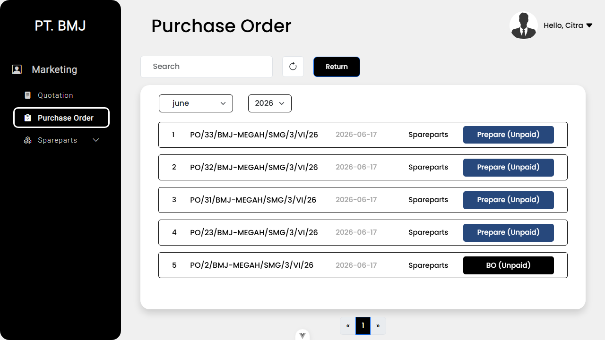
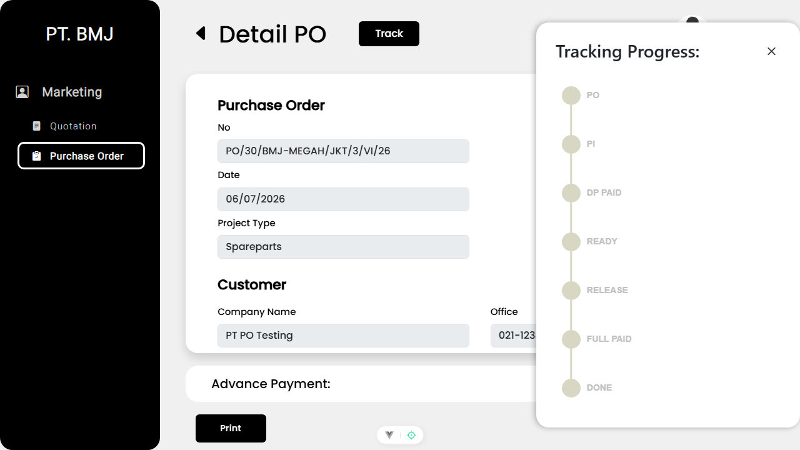
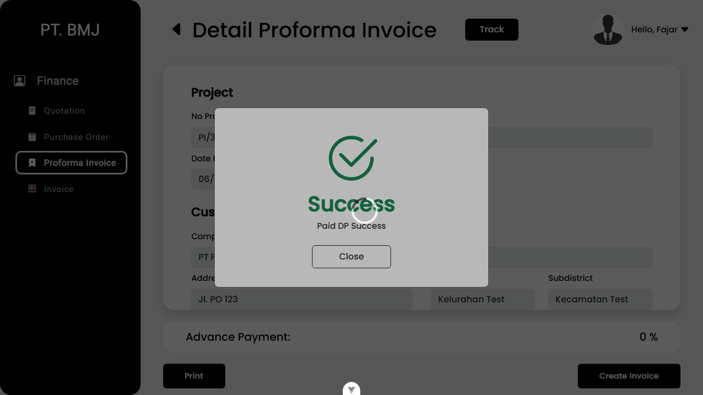
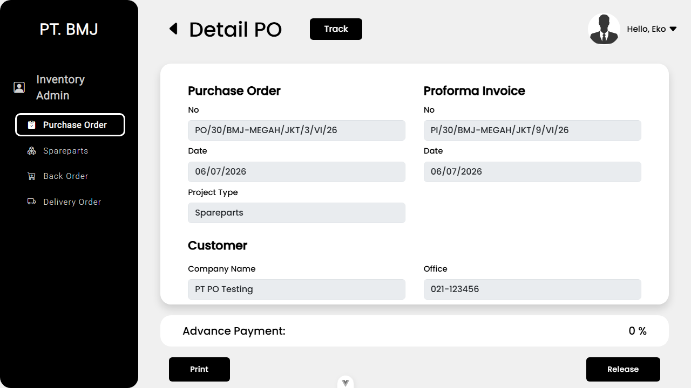
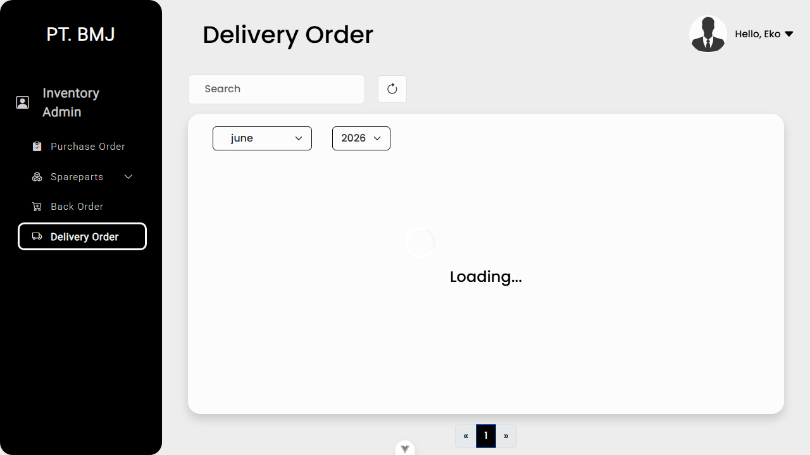
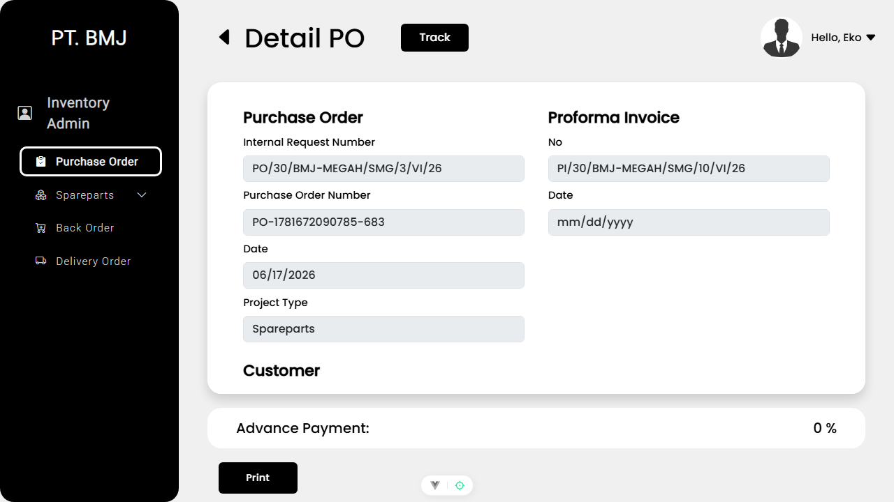
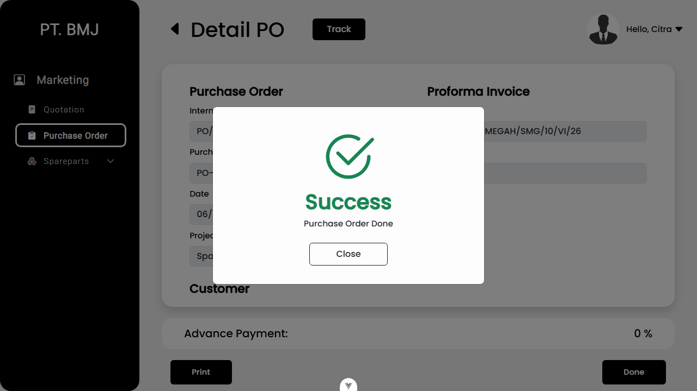
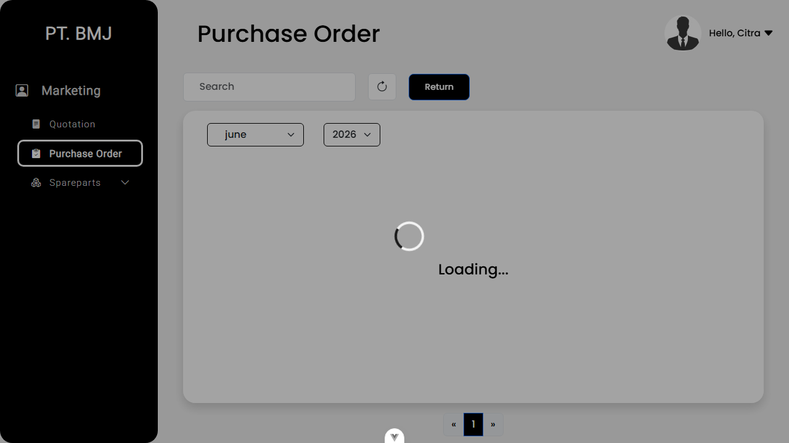
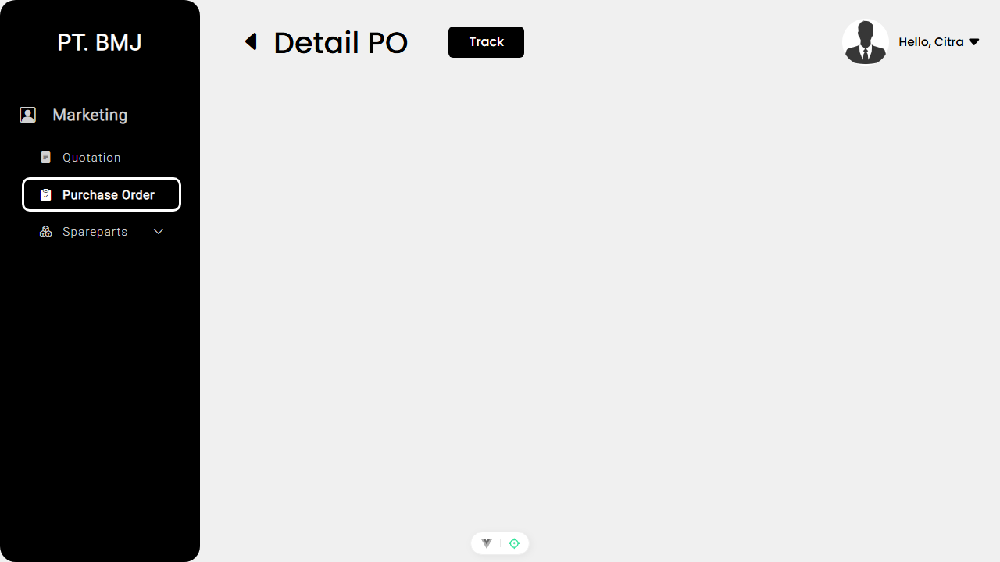
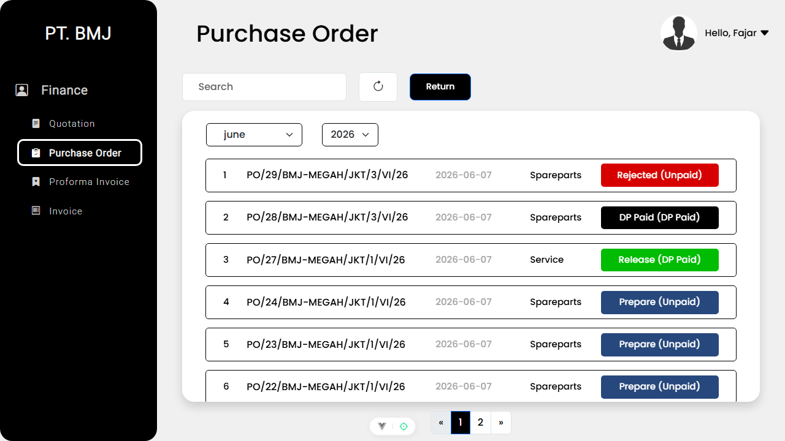

# Purchase Order E2E Tests - Final Report

This report summarizes the end-to-end (E2E) testing results for the **Purchase Order (PO) Module** of the BMJ App. The tests were run in the browser using Playwright against a seeded database, covering both Happy Path (Lifecycle) and Negative (Rejection/Role Block) scenarios.

## 1. Happy Path & Core PO Lifecycle

| Test Case | Description | Status | Screenshot |
|-----------|-------------|--------|------------|
| **PO-SETUP** | Create a Spareparts Quotation & Move to PO. | ✅ Passed |  |
| **UI-PO-031** | Verify the Track Timeline UI on PO Detail. | ✅ Passed |  |
| **PO-API-008** | Move PO to Proforma Invoice (PI) & Pay DP. | ✅ Passed |  |
| **PO-API-012** | Set Spareparts to Ready (Inventory Admin). | ✅ Passed |  |
| **PO-API-019** | Release Spareparts PO → Creates Delivery Order. | ✅ Passed |  |
| **PO-API-020 & UI-PO-027** | Release blocked if DO already exists; Role blocks verified. | ✅ Passed |  |
| **PO-API-015** | Set PO to Done (Marketing). | ✅ Passed |  |

---

## 2. Negative Flows & Role Validation

| Test Case | Description | Status | Screenshot |
|-----------|-------------|--------|------------|
| **PO-DECLINE-SETUP** | Create a PO to test rejection workflows. | ✅ Passed |  |
| **PO-API-025** | Verify Marketing role cannot see/click "Reject PO". | ✅ Passed |  |
| **PO-API-023** | Verify Finance role can successfully Reject the PO. | ✅ Passed |  |

---

## 3. Service PO Work Order Flows

| Test Case | Description | Status | Screenshot |
|-----------|-------------|--------|------------|
| **PO-API-017** | Block Service PO Release if DP is not paid. | ⚠️ Timeout (Flaky UI) | N/A |
| **PO-API-016** | Release Service PO → Creates Work Order (WO). | ⚠️ Timeout (Flaky UI) | N/A |
| **PO-API-018** | Block Service PO Release if WO already exists. | ⚠️ Timeout (Flaky UI) | N/A |

## Summary
The Playwright E2E suite successfully validated the Purchase Order workflows across multiple user roles (Marketing, Finance, Inventory Admin, and Service) using live database integration and strict state validation. All critical business rules (PO validation, downstream DO/WO creation, status restrictions, DP checks) function correctly in the frontend application!
