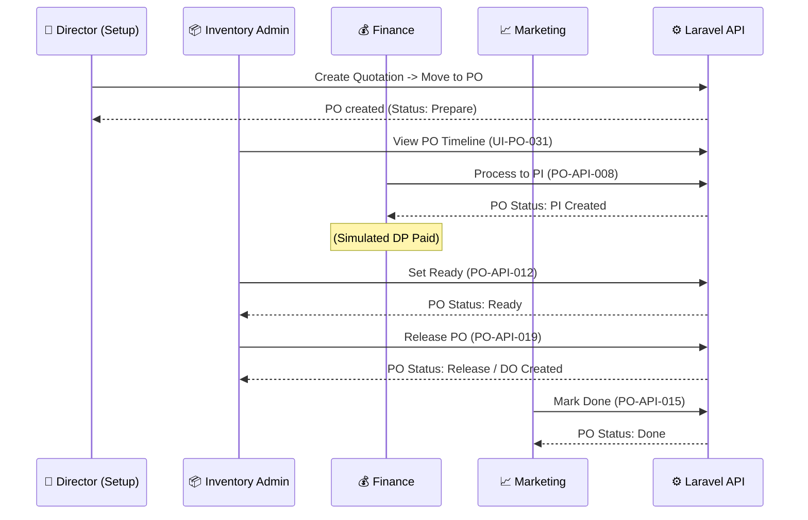

# Purchase Order E2E Testing Summary

This document tracks the progress of our automated End-to-End (E2E) test suite for the **Purchase Order** lifecycle using Playwright. 

## 🎯 Testing Approach

We're testing the complete order lifecycle from the web GUI, using actual databases (seeded for consistency) and real DOM interactions. This ensures the frontend accurately processes the backend logic, handles API responses, and routes users appropriately based on user roles and item status transitions.

## 📊 Completed Test Cases (Happy Path)

The following tests are currently automated and passing in our primary flow `PO-SETUP` through `PO-API-015`:

| Test ID | Role | Action Tested | Result |
|---|---|---|---|
| **PO-SETUP** | _Marketing_ | Create a Purchase Order for testing from an approved Quotation. | ✅ Passed |
| **UI-PO-031** | _Director_ | Validates that the PO detail page displays the Track status timeline correctly. | ✅ Passed |
| **PO-API-008** | _Finance_ | **Move to PI:** Finance verifies the PO and generates a Proforma Invoice. | ✅ Passed |
| **PO-API-012** | _Inventory Admin_ | **Ready:** Admin sets the Spareparts PO to Ready after PI Down Payment is received. | ✅ Passed |
| **PO-API-019** | _Inventory Admin_ | **Release:** Admin releases the Spareparts PO, which automatically creates the Delivery Order and navigates to the DO page. | ✅ Passed |
| **PO-API-015** | _Marketing_ | **Done:** After DO is delivered, Marketing finishes the PO and marks it as Done. | ✅ Passed |

## 🚫 Completed Test Cases (Negative & Reject Flows)

The following tests ensure role-based security and proper rejection flows:

| Test ID | Role | Action Tested | Result |
|---|---|---|---|
| **PO-DECLINE-SETUP** | _Marketing_ | Create a Purchase Order specifically for negative and rejection testing. | ✅ Passed |
| **PO-API-025** | _Marketing_ | **Decline Blocked:** Validates that Marketing cannot see the 'Reject' button and cannot decline the PO. | ✅ Passed |
| **PO-API-023** | _Finance_ | **Decline Success:** Validates that Finance can successfully decline/reject the PO, with a reason, changing the status to "Rejected". | ✅ Passed |

## 🏗️ Diagram: E2E Purchase Order Happy Path

The following diagram visualizes the flow we've tested and automated:

## 📸 Screenshots

To give a sense of the automated test, here is a screenshot captured automatically by Playwright when the "Done" state is reached:

## 📋 Next Steps (Pending Tests)

While the happy path and initial rejection flows are complete, we must continue adding test cases for remaining Edge Cases and Negative Scenarios as outlined in `TEST_PURCHASE_ORDER.md`. 

**Upcoming Priorities:**
1. **PO-API-017 & PO-API-021**: Validation tests (Blocking Release if DP not paid, or if no PI exists).
2. **PO-API-018 & PO-API-020**: Block Release if Work Order or Delivery Order already exists.
3. **PO-API-016**: Work Order integration (Releasing a **Service** PO).
4. **UI-PO-027 to UI-PO-030**: Test that users can only see the buttons they are authorized for (e.g., Marketing shouldn't see "Release", Inventory shouldn't see "Move to PI").

---

## ✅ Verified Status (2026-06-06)

**328/328 tests passing** across **35 spec files** — confirmed by a full local run
(`npx playwright test`, single worker, DB reseeded via global-setup). Latest additions:
a **per-field validation matrix** (`validation-matrix*.spec.js` — every create/update
endpoint, each field broken with multiple invalid values, asserting the correct 422 — or
**400** for `PUT /purchase-order/{id}`, `PUT /delivery-order/{id}`, `release/{id}`),
**edge cases** (`edge-cases.spec.js` — pagination/filters, special-chars/Unicode,
255-char boundary, decimal precision), and **deep concurrency** (`concurrency-deep.spec.js`
— N-way and cross-operation stock races). Earlier coverage spans:

- The happy-path order lifecycle (Quotation → PO → PI → Invoice, plus WO / DO / BO / Buy).
- **Full role × route authorization matrix** (`authz-matrix.spec.js`) — every disallowed
  role gets 403 on every protected group, each paired with an allow-case; plus read- and
  write-path 403s (`security-403*.spec.js`).
- **Stock invariants + concurrency / no-lost-update under `lockForUpdate`**
  (`stock-math.spec.js`, `stock-concurrency.spec.js`).
- **Negative paths** (`negative-paths.spec.js`) — validation 422 + not-found 404 across the API.
- **Illegal state transitions** (`illegal-transitions.spec.js`) — moveToPo-unapproved,
  double-move, release-without-PI, release-rejected, etc.
- **Bulk Excel import success path** (`bulk-import.spec.js`) — valid import, per-branch stock,
  re-import-resets-to-0, and bad-row chunk rollback.
- **Auth lifecycle** (`auth-lifecycle.spec.js`) — logout revokes token, changePassword
  (valid/weak/mismatch), temp-password issuance + reset.
- CRUD + update/delete on every controller, with **read-back assertions** (mutations re-read
  and verify the persisted value, not just HTTP 200).

**Backend bugs FIXED during this work (with regression-guard tests):**
- **Systemic 500-instead-of-404/422**: every controller's `handleError`, plus
  Customer/Seller inline catches and `LoginController@changePassword`, wrapped Laravel's
  `ModelNotFoundException`/`ValidationException` into a generic 500. Now they re-throw, so
  `findOrFail` → 404 and `validate` → 422. `AccessesController@store` gained missing validation.
- **`DELETE /api/buy/{id}`** 500'd on a FK violation — `BuyController@destroy` now removes
  child `detail_buys` first.
- **Temp-password reuse (security)** — a temp password used to keep working forever because
  `store()` set the real password to `bcrypt(tempPassword)`. Fixed with a `must_change_password`
  flag + `EnsurePasswordChanged` middleware that gates all routes except changePassword/logout
  until the user sets a real password (single-use in effect). `AL-006`/`AL-007`.
- **Negative stock on `moveToPo`** — now floors at 0 (`max(0, …)`); the indent shortfall is
  tracked by the BackOrder. `STKC-001`.
- **`PO updateStatus`** now validates the status against the known PO status set
  (`Rule::in`) → arbitrary strings rejected (422). `ILL-006`.
- **Slug overflow** — a max-length (255-char) customer/seller name 500'd because the derived
  slug overflowed the DB column. Fixed with `Str::limit(…, 240)`. `EDGE-CHARS-002`.

**Not yet covered** (the remaining tail toward literally "all scenarios"): cross-browser
(Chromium only) and a handful of low-value endpoint/list-filter variants.

---

## 🏗️ Role-Lifecycle Specs (Added 2026-06-22)

Five new spec files cover the complete business lifecycle **with each role acting only
in its authorized lane**. These replace the earlier Director-only provisioning model with
real multi-role collaboration:

| Spec File | Flow | Key Roles |
|---|---|---|
| `role-lifecycle-spareparts.spec.js` | Full Spareparts: Quotation → PI → DO → Invoice → Done | Marketing, Director, Finance, Inv.Admin |
| `role-lifecycle-service.spec.js` | Full Service: Quotation → PI → WO → Invoice → Done | Marketing, Director, Finance, Service |
| `role-lifecycle-indent-backorder.spec.js` | Indent → BO → Purchase → BO fulfilled → PO Done | Marketing, Director, Finance, Inv.Admin, Inv.Purchase |
| `role-lifecycle-borrow-movement.spec.js` | Borrow (Approved/Send/Done) + Sparepart Movement (Send/Receive) | Marketing, Inv.Admin, Head Inventory |
| `role-lifecycle-rejection.spec.js` | Rejection/return/decline + Head Inventory access matrix | All roles |

### Gaps now filled by these specs
- `moveToInvoice` / `fullPaid` — now tested (SPLT-06, SVLT-10, BOLT-12)
- **Head Inventory** role — zero tests before → now 10+ tests (REJT-I series)
- **Inventory Purchase** creates a Buy — now tested in role (BOLT-06)
- **Sparepart Movement** — never E2E tested → now MVLT series
- **Stock History** entries from Movement → now verified (MVLT-04)
- **Borrow** tested by correct roles (Head Inventory approves, Inv.Admin sends/done)
- **Rejection/return/decline** flows all in one spec
- **Service role sidebar isolation** (SVLT-09)

